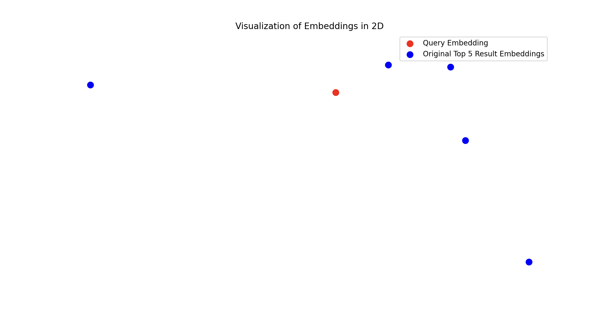
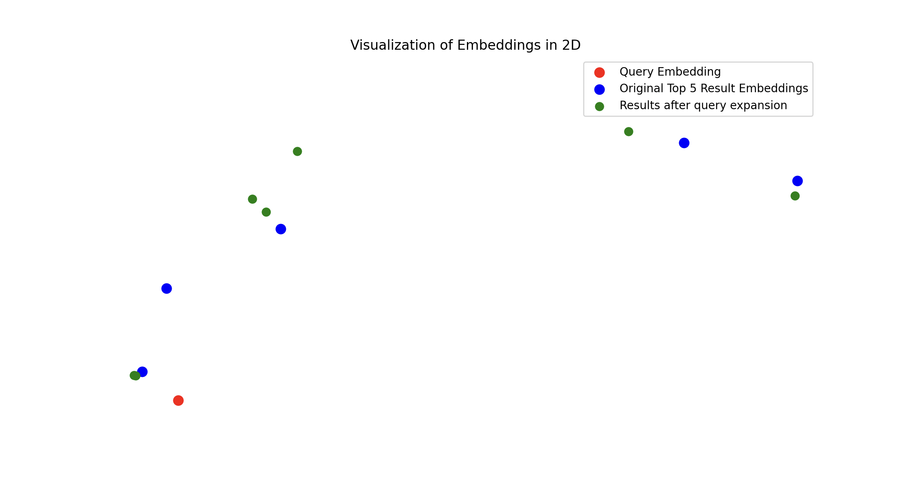

# Visualisation of embedding's distance to original query, and applying query expansion.

I was looking for a way to visualise how close/far the extracted embeddings from a vector database are when I am querying it for external information. I came across [this article](https://medium.com/@sumit_datta/is-your-rag-hallucinating-look-under-the-hood-97d70040563b) that shows how you can use [umap](https://umap-learn.readthedocs.io/en/latest/) to collapse a high-dimensional array into a 2D array that you can visualise on a 2D plot.

I added query expansion and score thresholds. Although to be honest one can also use an abstraction on-top of chroma or a more advanced implementation of a vectordb to do apply thresholds to the extracted distances. Still, query expansion is a nice technique.

Before query expansion I had this as a result:

 

And after:

 

Check the output below:

> python main.py augment "What is untrue about eventsourcing?" --restrict  
> 0.52442545  
> 0.5241878  
> 0.52071166  
> 0.5205327  
> 0.5202506  
> 0.51975715  
> 0.51915485  
> 0.5189648  
> 0.51892877  
> 0.51761144  
> The document provides a few insights that indicate what is untrue about events sourcing. Here are the key points:  
> 
> 1. **The Misconception of Access**: One argument often heard in favor of Event Sourcing is that it provides access to all events from all systems, allowing for versatile use of the events stored in the Event Store. However, this notion is described as being "too good to be true" (see page 88). The reality is that accessing internal events directly can create significant coupling between systems, akin to directly accessing a database.  
> 
> 2. **Coupling Consequences**: The document highlights that if systems are allowed to read internal events, it results in massive coupling. This means that any change in the data structure (like adding mandatory fields) would require consulting all systems that depend on this data structure, which drastically decreases operational velocity and can halt development (see page 89).  
> 
> 3. **Internal Events vs. Database Direct Access**: Accessing internal events has technical parallels with allowing direct database access. This approach makes the system rigid and reliant on predefined agreements about the data structure, which can be problematic when changes are needed (see page 89).  
> 
> 4. **Client Dependency and Changes**: The document mentions that clients of the data may need time to make adjustments on their side after a change in the structure, which adds additional friction and can lead to refusal from clients to make necessary adjustments (see page 89).  
> 
> 5. **Business Logic Leakage**: If systems can access internal domain events, they must understand the meaning of every event for proper use. This necessitates deep domain knowledge and complexities regarding business rules, which could change over time, complicating system interactions (see page 90).  
> 
> In summary, while Event Sourcing is often touted for offering comprehensive access and flexibility, the assumptions around it can lead to significant coupling and complexity.
